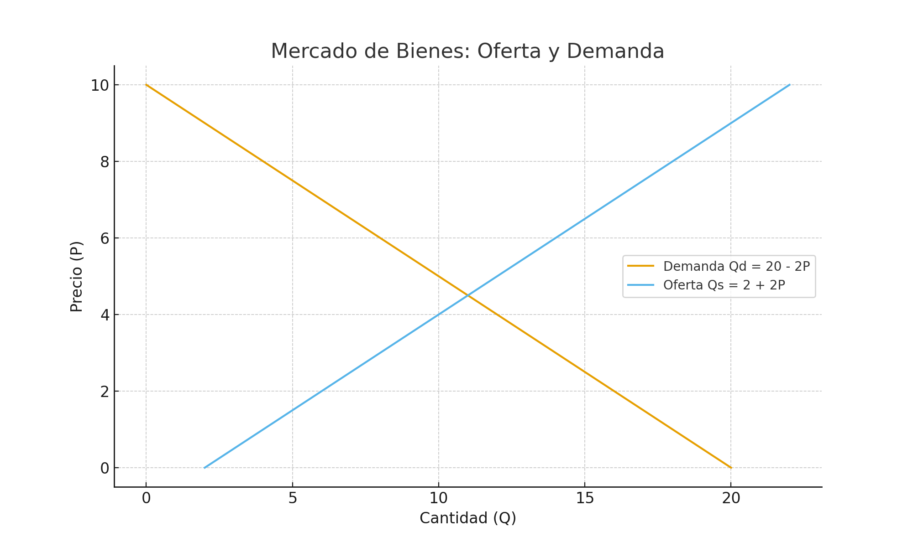
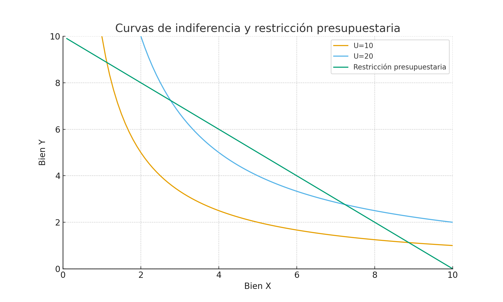
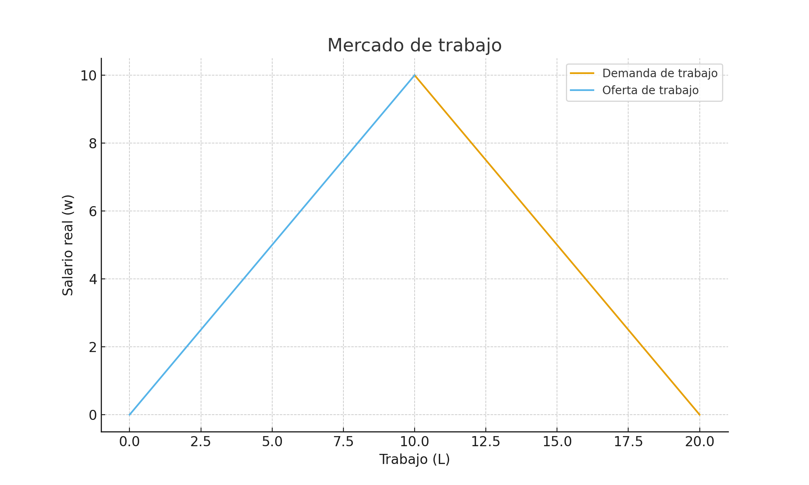

# Clase 2 – Neoclásicos

Apuntes integrados con la clase teórica y gráficos.

## Mercado de Bienes

Qd = a - b·P  
Qs = c + d·P  

El equilibrio se encuentra en la intersección de ambas curvas.

---

## Teoría del Consumidor

- Las curvas de indiferencia representan combinaciones de bienes que dan igual utilidad.  
- La recta presupuestaria representa las combinaciones posibles dados ingresos y precios.  
- En el óptimo: **TMS = Costo de Oportunidad**.

---

## Teoría del Productor

- Isoquanta: combinaciones de factores (L,K) que producen igual cantidad.  
- Isocosto: combinaciones de factores con igual costo total.  
- En el equilibrio: **TMST = w/r**.

---

## Mercado de Trabajo

- Oferta de trabajo: trabajadores que desean trabajar según salario real.  
- Demanda de trabajo: empresas que contratan en función del salario.  
- El desempleo “neoclásico” se considera voluntario.  

---

## Mercado de Dinero y Precios

Teoría cuantitativa del dinero:

**M · V = P · Y**  

- M: oferta monetaria  
- V: velocidad de circulación  
- P: nivel de precios  
- Y: producto real  

---

