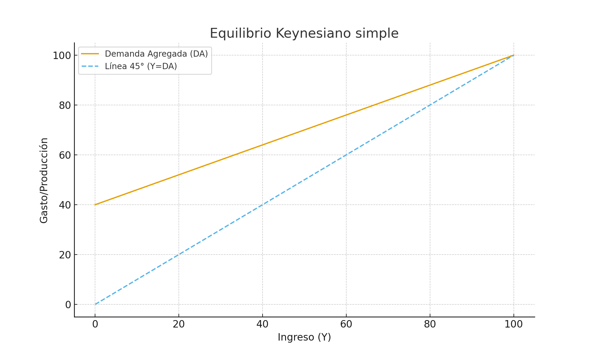
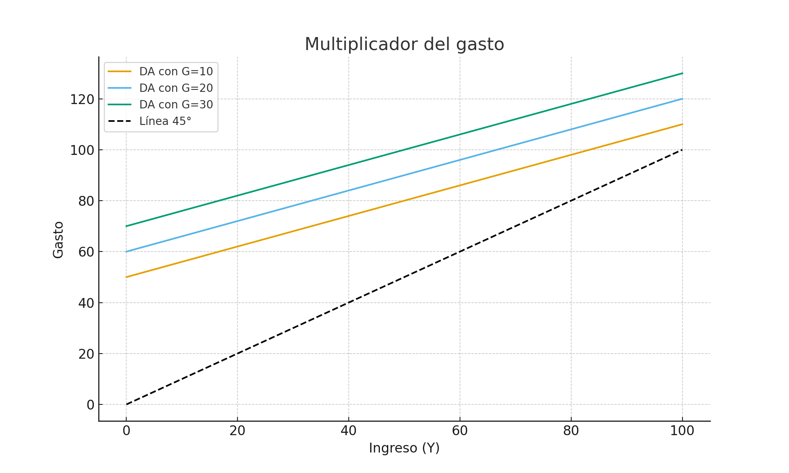
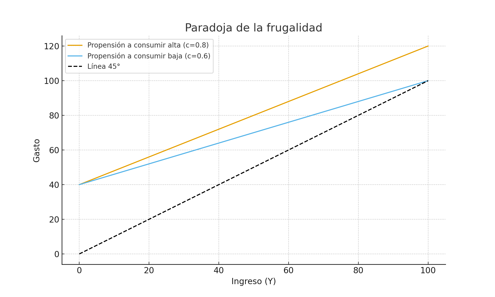

# Clase 3 – Keynes

Apuntes ampliados con base en la clase teórica y gráficos ilustrativos.

## Repaso clase 2 (Neoclásicos según Keynes)

- El salario real vigente determina si las personas se ofrecen a trabajar.  
- El trabajador elige entre ocio y bienes → curva de indiferencia.  
- Se ofrecen más trabajadores si el salario es mayor a la desutilidad de trabajar → baja el salario hasta el equilibrio.  

**Críticas de Keynes**:  
- **Productividad marginal**: más trabajadores reducen el valor marginal del producto → menor incentivo.  
- En crisis: desempleo, caída de producción e inflación se explican porque no se cumplen los supuestos (salario mínimo, controles de precios, sindicatos, tasa de interés alta).  
- Respuesta neoclásica: ajustar salarios y precios hasta volver al equilibrio.  
- Keynes: esto no ocurre automáticamente → existe desempleo involuntario.  

---

## Teórica

### Ortodoxia neoclásica

- Economía **autorregulada**: toda intervención empeora.  
- Ley de Say: “toda oferta genera su propia demanda”.  
- Dinero: mero medio de cambio, no afecta variables reales.  
- Tasa de interés: equilibra ahorro e inversión.  

### Contexto histórico

- Crack de 1929: especulación, crédito barato → burbuja → venta masiva → caída de precios.  
- Desempleo masivo y pérdida de confianza en mercados financieros.  

### Crítica de Keynes al mercado de trabajo

- No acepta que salario real = desutilidad marginal del trabajo.  
- Crítica empírica: inflación reduce poder adquisitivo sin ajuste salarial.  
- Crítica teórica: trabajadores negocian salario nominal, no real → empresarios ajustan precios → salarios reales dependen del empresario.  

### Crítica al mercado de capitales

- Neoclásico: ahorro depende de la tasa de interés.  
- Keynes: ahorro depende del ingreso; la tasa de interés es **recompensa por perder liquidez**.  
- El capital no genera valor por sí mismo → aumenta productividad del trabajo, pero no crea valor directo.  
- Expectativas (“animal spirits”) definen la inversión.  

---

## Modelo Keynesiano simple

- **Consumo**: C = C⁻ + cY  
- **Inversión**: depende de expectativas, no de la tasa de interés.  
- **Demanda Agregada (DA)**: DA = C⁻ + I⁻ + cY  

En el equilibrio: Y = DA.  

---

## Multiplicador del gasto

Un aumento del gasto (G) desplaza la DA → el ingreso crece más que proporcionalmente.  

- El gasto público puede sacar a la economía de la recesión.  
- Contrasta con la Ley de Say: aquí la **demanda crea oferta**.  

---

## Paradoja de la frugalidad

Mayor propensión al ahorro reduce la DA y el nivel de ingreso.  

- El ahorro individual puede ser racional.  
- El ahorro agregado reduce la demanda → crisis → desempleo.  

---

## Conclusión

- Keynes rompe con la idea de equilibrio automático.  
- Destaca el rol de la demanda efectiva y las expectativas.  
- Justifica la intervención estatal vía política fiscal y gasto público.  

---
