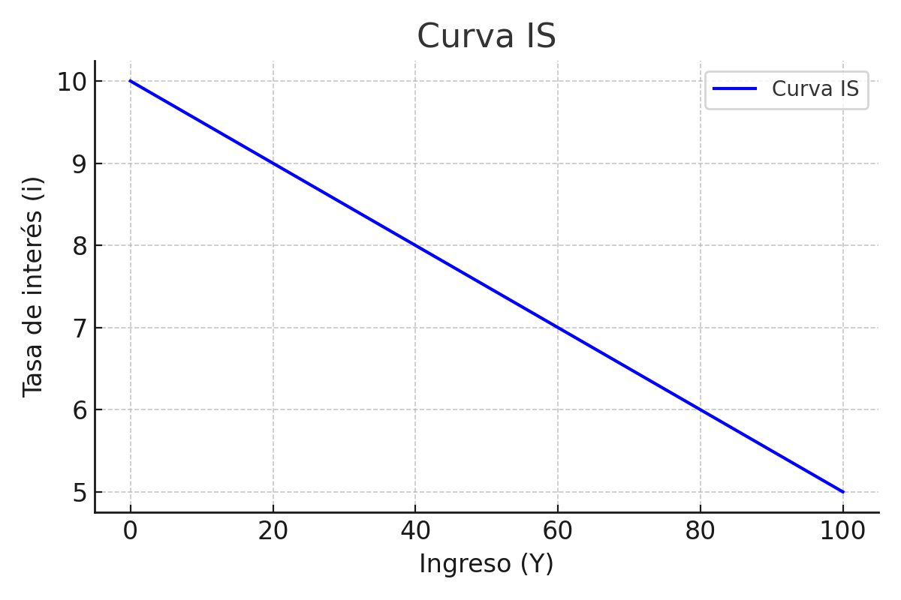
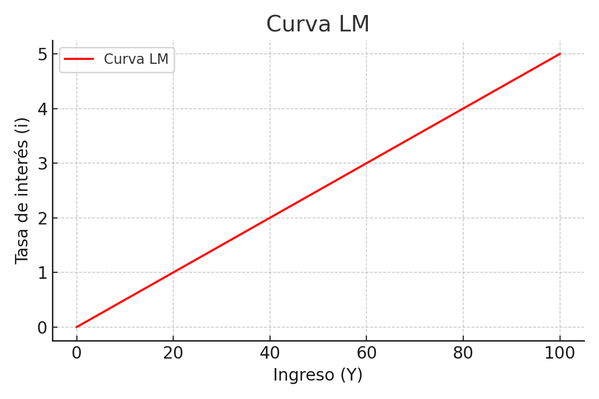
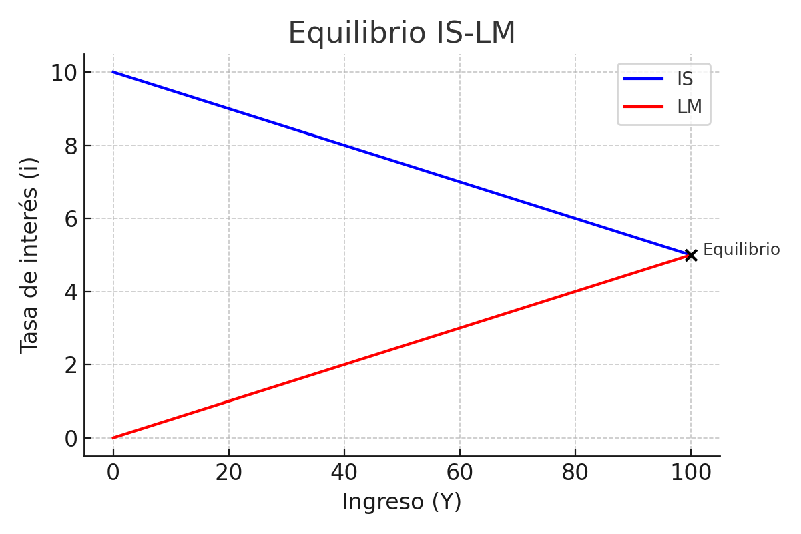
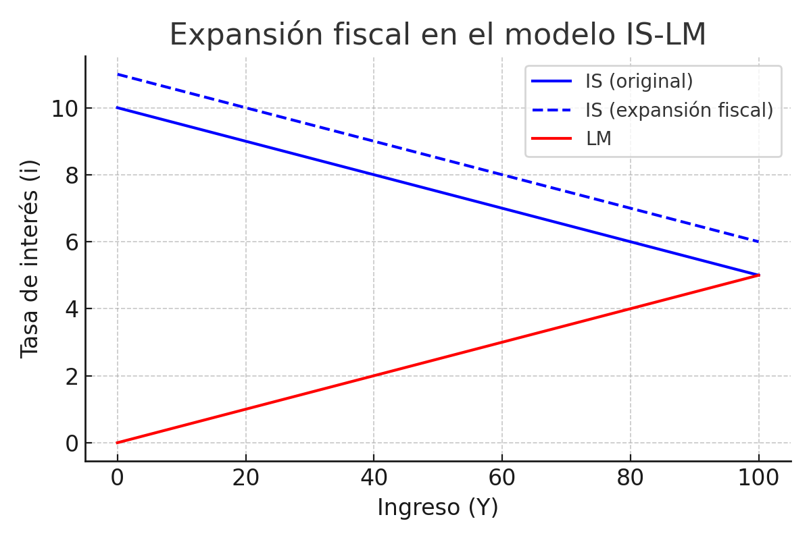
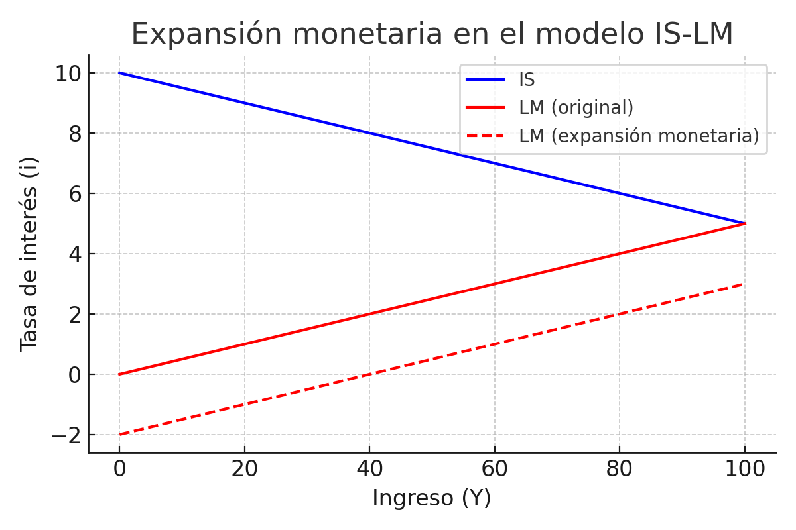

# Clase 4 – Modelo IS-LM

## Repaso clase 3

¡Llegué tarde!  

Hablaron un poco de Keynes y de cómo no todos los agentes del mercado toman las mejores decisiones y se dejan llevar por las emociones.  
Ya no son un colectivo la suma de los egoísmos.  

### Gráfico introductorio

Se asume que estas tres cosas son iguales siempre (Demanda Agregada, Producto y Valor Agregado):  

- Eje Y: DA  
- Eje X: Y1 e Y2  

Donde tenemos:  
- Una recta Y = DA = VA  
- DA = C + I + G + X  

Existen 2 puntos de equilibrio (los Yi de antes), que se generan cuando la recta diagonal interseca a otras 2.  

### Elasticidad

**Elasticidad (en economía)**:  
\[ E = \frac{\% \Delta Q_s}{\% \Delta P} \] 

- Mide la sensibilidad entre dos variables.  
- En el mundo neoclásico, las curvas suelen asumirse como inelásticas: todos ofrecen todo lo que tienen.  

👉 Por eso Keynes afirma que su modelo es un caso general del neoclásico, ya que **puede haber equilibrio con desempleo**.  

### Tasa de interés: igualdad ahorro–inversión

Motivos por los que Keynes dice que la gente quiere tener dinero líquido:  
- **Motivo transaccional**: para realizar operaciones.  
- **Motivo especulativo**: por si aparece algún negocio.  
- **Motivo precautorio**: por si ocurre alguna emergencia.  

### Eficiencia marginal del capital

- No depende del valor absoluto de la tasa de interés, sino de la **expectativa de ganancia**.  
- Ahorro = Inversión:  
  - Neoclásicos → se necesita ahorrar primero para invertir. El ahorro es la base de la fortuna.  
  - Keynesianos → puede haber ahorro con desempleo. El ahorro y la inversión no se determinan en el mismo mercado.  

### Los 3 mercados neoclásicos

- Bienes → Precio  
- Trabajo → Salario (oferta de los trabajadores y demanda de las empresas)  
- Capital → Tasa de interés  

### Cómo se establecen en Keynes

- Consumo: \( C = C_0 + cY \)  
- Salarios: se negocian con sindicatos, **extraeconómicamente**.  
- Salario real: no es lo que se negocia, sino lo que resulta tras los precios fijados por el empresario.  

👉 El ahorro como lo ven los neoclásicos **se derrumba completamente**.  

### Rol del Estado según Keynes

- Ejemplo: contratar gente para cavar agujeros por la mañana y taparlos por la noche.  
- Objetivo: mantener a la gente ocupada → generan consumo.  
- Si cae el ahorro y la inversión, **el Estado debe intervenir**.  

---

## Teórica: Hicks y el IS-LM

### Motivación

- Hicks busca una **contrarreforma** al impacto de Keynes.  
- Reinterpreta Keynes y plantea el modelo **IS-LM** como caso general.  

### Punto de partida

- Tres miradas del PBI.  
- Economía autorregulada (neoclásico) vs. actuación necesaria del Estado (Keynes).  

### Rol del Estado

Políticas disponibles:  
- **Gasto público (G)**: inversión pública o salarios.  
- **Transferencias (R)**: al sector privado.  
- **Impuestos de suma fija (T°)**.  
- **Impuestos proporcionales (t)**: una fracción del ingreso.  

👉 **Multiplicador Keynesiano**: cuando consumo, genero ingresos en otro → este consume → se expande el efecto.  

### Replanteo de la inversión

Inversión:  
\[ I = aY - bi + I^* \]  

Depende de:  
- **Nivel de actividad (Y)**: ventas presentes o esperadas.  
- **Tasa de interés (i)**: costo del crédito.  
- **Componente irracional (I^*)**: expectativas, psicología empresarial (*animal spirits*).  

### Curva IS

- Relación negativa entre ingreso y tasa de interés.  
- Si baja \(i\), aumenta la inversión y la demanda agregada.  

  

### Activos financieros

- **Bonos**: renta cierta (títulos públicos) o incierta (acciones).  
- **Dinero**: activo sin renta.  

### Política monetaria

Objetivos del Banco Central:  
- Preservar el valor de la moneda.  
- Ser prestamista de última instancia.  

**Creación primaria de dinero**: emisión por parte del Banco Central.  
**Creación secundaria de dinero**: a través de créditos del sistema bancario.  

### Curva LM

Demanda de dinero:  
\[ M^d = kY - l(i - i^e) \]  

- Si aumenta el ingreso (Y), sube la demanda de dinero.  
- Si la tasa de interés (i) sube, baja la demanda especulativa de dinero.  

  

---

## Equilibrio IS-LM

El equilibrio se da en la intersección de IS y LM:  

  

---

## Políticas en IS-LM

### Expansión fiscal

- Aumenta G → desplaza IS hacia la derecha.  
- Más ingreso, pero también más tasa de interés.  

  

### Expansión monetaria

- Aumenta la oferta de dinero → desplaza LM hacia abajo.  
- Baja la tasa de interés y sube el ingreso.  

  

---

## Conclusiones

- Hicks reinterpreta a Keynes dentro de un marco más amplio.  
- El modelo IS-LM permite analizar tanto políticas fiscales como monetarias.  
- Keynes → equilibrio con desempleo.  
- Neoclásicos → equilibrio siempre eficiente.  
- La síntesis: depende del contexto (corto plazo keynesiano, largo plazo neoclásico).  
