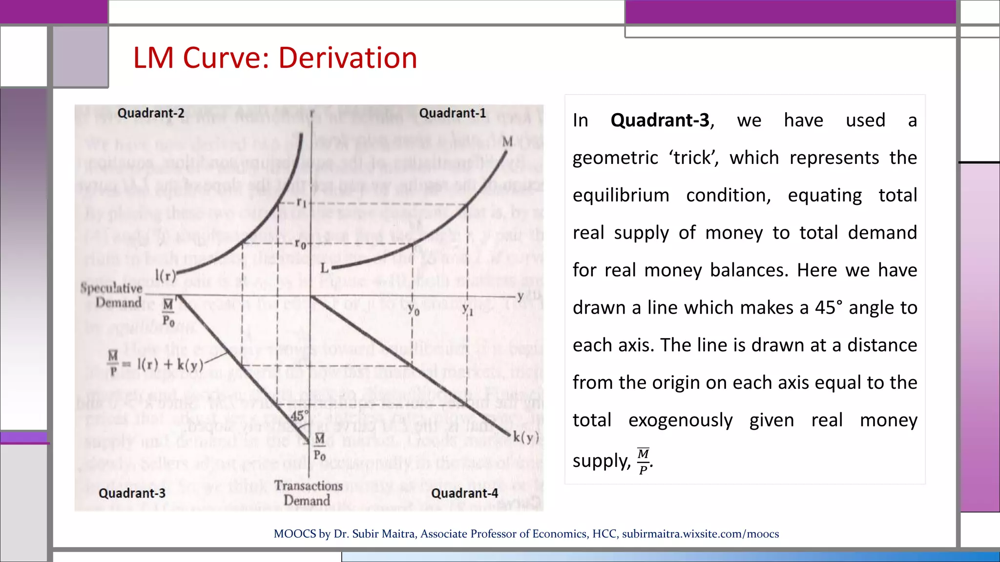
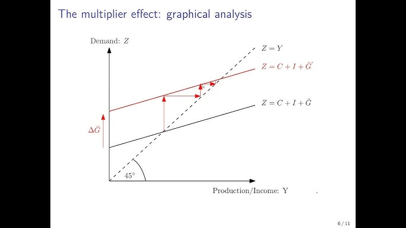
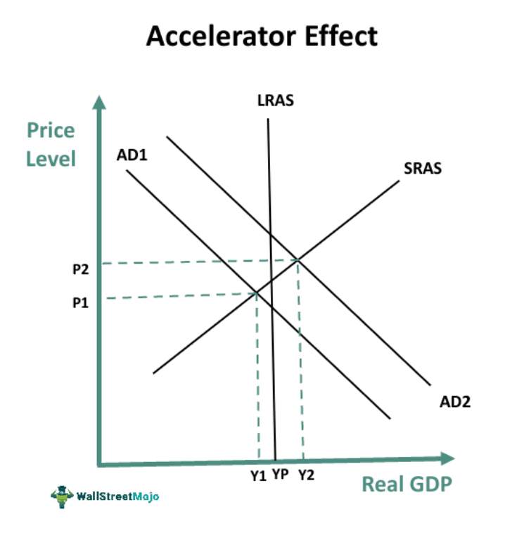

# Clase 5

## Repaso

¿Qué cambia? El dinero y cómo se fija la tasa de interés con respecto a lo que pensaba Keynes.

- **Keynes**: el consumo depende del ingreso. Primero se consume y el ahorro es lo que sobra.  
- **Neoclásicos**: la tasa de interés regula la decisión de consumir hoy o mañana. Si el retorno es alto, pospongo consumo para mañana.

👉 En políticas públicas: para Keynes conviene transferir ingresos a quienes consumen, no a quienes ahorran.

---

## Práctica

### Mercado de Bienes

- La tasa de interés es un **dato exógeno** (proviene del mercado de dinero).  
- Si DA > Y → caída de existencias → señal a los productores de aumentar producción.  
- Si Y > DA → acumulación de stock → freno en la producción.  
- **Precondición**: existen máquinas ociosas → la producción puede aumentar sin restricciones tecnológicas.  

Políticas posibles para empujar DA:  
- Aumento de gasto público.  
- Transferencias al sector privado.  

### Mercado de Dinero

- El multiplicador monetario depende de los bancos, **no de la tasa de interés**.  
- Demanda de dinero:  
  - **Transaccional**.  
  - **Precaución**.  
  - **Especulación**: inversa al precio de bonos.  
- Relación: si baja el precio de los bonos → sube la tasa de interés.  

Ejemplos:  
- Shock en demanda de dinero → afecta nivel de producto.  
- Shock en oferta de dinero → baja la tasa de interés → compra de bonos → sube su precio.

### IS-LM

Combinación de mercados de bienes y dinero.  

- **Crowding-out**: aumento de G → sube Y → sube demanda de dinero → sube i → cae inversión privada.  
- Para evitarlo → coordinación de políticas fiscal y monetaria.  

La pendiente de LM:  
- **l → ∞** → mundo keynesiano (trampa de liquidez, i = 0).  
- **l → 0** → mundo neoclásico (nadie quiere liquidez, todo va a bonos).  



### Un poco más de Modelica

```modelica
when (condition) then
   | equation |
end when;

when (time > K) then
   | G0 = 120; |
end when;
```

---

## Parcial

- Formato **multiple choice**.  
- No orientado al desarrollo matemático.  
- No se usa Modelica.  
- Sí hay que saber formular ecuaciones (ej: DA = C + I + G + X).  
- Central: entender el rol de la tasa de interés en Keynes y en los neoclásicos.  

---

## Teórica

### Modelos de Crecimiento

- Keynes: si la tasa de interés sube → política para bajarla → más inversión.  
- En corto plazo: la inversión determina nivel de actividad, empleo y salarios.  
- En largo plazo: la inversión acumula capital → aumenta capacidad productiva.  

#### IS-LM

- **Corto plazo**: precios fijos, capacidad ociosa. Mundo keynesiano.  
- **Largo plazo**: precios flexibles, pleno uso de capacidad → mundo neoclásico.  

👉 Estado como regulador: no interviene siempre, solo ante crisis.

#### Modelo Keynesiano de largo plazo

- Función de producción **Leontief** (coeficientes fijos, no hay sustitución).  
- Crecimiento depende de inversión y disponibilidad de trabajo.  
- La decisión ahorro-inversión es autónoma, no de equilibrio de mercado.  

#### Modelo de Harrod

- Principio del multiplicador:  



- Principio del acelerador:  



- Tasas de crecimiento:  
  - Garantizada (pleno uso capacidad).  
  - Efectiva (observada en la economía).  
  - Natural (crecimiento de trabajo + productividad).  


#### Modelo de Domar

- Similar a Harrod pero enfocado en mantener el pleno empleo.

#### Modelo de Solow

- Función de producción Cobb-Douglas:  
  Y = A · K^α · L^β, con α+β=1.  
- Existen equilibrios ex-ante y ex-post (I = S siempre).  
- Estado estacionario definido por intersección de inversión y depreciación.  


---
